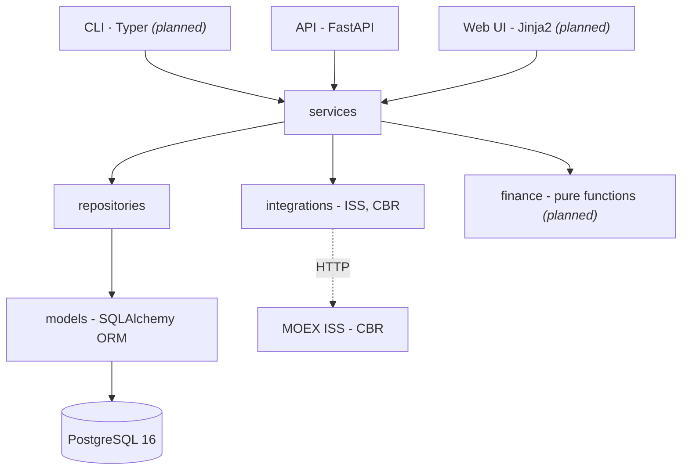
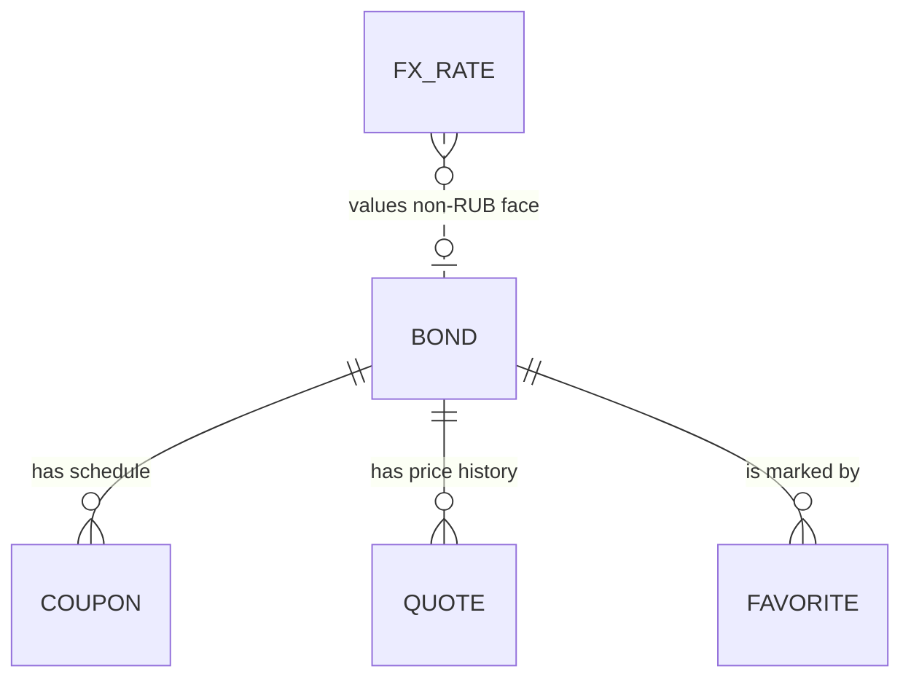

# Architecture

This document describes the shape of the system and the rules that keep that shape stable.
Individual decisions and their rejected alternatives are recorded separately in [`README.md`](/README.md#trade-offs--scope).

**Status of this document.** Modules marked *(planned)* do not exist yet. They are part of the roadmap.

---

## 1. Layers

Dependencies point in one direction only: **entry points → services → repositories → models**. `finance/` and `integrations/` are leaves. They are called by services and call nothing inside the application.

The rule is enforced by reading, not by tooling. Two violations are worth naming because they are the tempting ones:

- **A repository importing from `integrations/`.** It would make loading marginally shorter and would tie the storage layer to the shape of an external API that changes without notice.
- **`finance/` importing an ORM model.** It would make call sites shorter and would cost the ability to test financial math without a database. That test property is the entire reason the layer is separate.

## 2. What crosses each boundary

Layer diagrams are cheap; the substance is what changes form at each seam. There are three.

### 2.1. `integrations/` → `services/` external shape stops here

MOEX ISS returns a column-oriented structure: a `columns` array of names and a `data` array of positional rows. That representation exists for wire efficiency and has nothing to do with the domain.

The client parses it into `*Raw` Pydantic schemas, one per ISS table, named after the table, with fields named as ISS names them. It performs no domain interpretation: it does not decide what kind of bond something is, does not compute anything, does not know that `FACEVALUE` is money.

Mapping from `*Raw` to domain values happens in the loader, in `services/`. This is the only place in the codebase that knows both vocabularies.

Two consequences of putting the seam here:

- The client is testable against saved JSON fixtures with `respx`, without a database and without any domain knowledge in the test.
- When ISS changes a column, exactly one `*Raw` schema and one mapping function change. Nothing below `services/` is aware that anything happened.

The CBR client is the same pattern over XML instead of JSON: parse into `*Raw`, map in the loader.

### 2.2. `services/` → `repositories/` the domain stops here

Repositories accept and return domain values and ORM entities. They know nothing about ISS, about CLI arguments, or about HTTP.

Their contract is narrow on purpose:

- **`flush`, never `commit`.** See §4.
- **No business rules.** A repository does not decide whether a bond should be updated; it performs the upsert it is told to perform.
- **Bulk operations are first-class.** Loading is a bulk activity, so bulk upsert is part of the interface rather than a loop over single-row calls at the call site.

### 2.3. `services/` → `finance/` infrastructure stops here *(planned)*

`finance/` takes value objects and primitives, such as a cash flow schedule, a price and a settlement date, and returns values. It does not take ORM models, sessions or clients.

Consequences that are worth the extra mapping step at the call site:

- Tests for YTM, duration and accrued interest run without Docker, in milliseconds, and can therefore be numerous and check reference values for real instruments.
- The functions are deterministic: no `datetime.now()` inside, the settlement date is always an argument. A financial function whose result depends on when it ran cannot be tested against a reference value.

## 3. Domain model

- **`bond`** a traded instrument, identified by ISIN and SECID. Carries face value, currency, maturity, coupon frequency and the classification derived from its ISS board.
- **`coupon`** one scheduled interest payment: date, amount, coupon rate. Unique per instrument and date, which is what makes repeated loading idempotent.
- **`quote`** end-of-day price for an instrument on a trading date. Unique per instrument and date, for the same reason. Intraday prices are out of scope entirely.
- **`fx_rate`** official Central Bank rate for a currency on a date, used to value instruments denominated in something other than roubles.
- **`favorite`** a user's marked instrument. Carries a reserved owner column so that stays reversible without a schema migration (no auth, no multi-tenancy).

**Naming.** Entities are named after things that exist in the bond market, not after things that exist in the implementation. This is constitution principle I, and it is the reason `app/models/` answers "what is this project about" on first open.

**Known inconsistency.** `app/models/__init__.py` currently re-exports a `BondType` name while the model module defines `IssuerType` and `CouponType`. This must be resolved before the stage 2 mapping layer is written, since that layer is the first consumer of these enums.

## 4. Transaction ownership

**Repositories `flush`; the caller `commit`.**

Only the caller knows what constitutes one unit of work. A CLI command loading two thousand instruments and an HTTP request creating one favourite have different notions of "done", and a repository cannot distinguish them.

`flush` is still called inside repositories, because the code that follows frequently needs database-assigned values, such as primary keys, defaults and generated columns, before the transaction ends.

Owners in practice:

| Caller | Unit of work |
|---|---|
| CLI command *(planned)* | one load run, or one chunk of one, stated per command |
| API request | one request, via a session dependency |
| Test | one test, usually rolled back rather than committed |

The corollary that catches people: **a repository that commits makes every caller's transaction boundary a lie**, and the failure is invisible until something needs to roll back across two repository calls.

## 5. Concurrency

Async end to end, with one hard constraint that shapes the loaders.

**`AsyncSession` is not safe for concurrent use.** Firing several repository calls into `asyncio.gather()` on one session produces either a runtime error or, worse, silently interleaved state.

Loading is therefore two-phase:

1. **Fetch.** Network calls run concurrently, bounded by a semaphore. No session is touched.
2. **Write.** Results are written strictly sequentially through the session.

This is not a performance compromise: the network phase is where the time goes, and it is the phase that is parallel. The write phase is bulk-upsert chunks, which are fast regardless.

**Chunk size.** Bulk upserts are chunked at 500 rows because PostgreSQL caps bind parameters at 65535; at roughly a dozen columns a single statement tops out near 5000 rows. Chunking now costs one line; discovering the ceiling during the first full load of every board costs an evening.

## 6. Error handling on ingestion

External data is assumed to be partly broken (constitution principle VIII). One malformed instrument does not abort a run of two thousand.

The rule that makes this safe rather than sloppy:

- **Broad exception handling is permitted at the mapping step.** That is where unpredictable external data meets strict domain types, and where "skip this one and record it" is the correct behaviour.
- **Never at the write step.** A failure there means the database or the code is wrong, and swallowing it hides a real defect.

Every load returns a report rather than `None`: `fetched / written / skipped / failed`, with failed items identified. A loading function that can silently lose rows is a defect regardless of whether it raised.

## 7. Testing layers

Test strategy follows the layer boundaries, which is most of why the boundaries exist.

| Layer | Infrastructure | Substituted | Notes |
|---|---|---|---|
| `finance/` *(planned)* | none | nothing | pure functions, reference values for real instruments, tolerance 0.01–0.05 p.p. |
| `integrations/` | none | HTTP via `respx` | saved JSON/XML fixtures, committed |
| `repositories/` | real PostgreSQL via testcontainers | nothing | schema via `create_all`, not `alembic upgrade` |
| `services/` | none | typed hand-written fake clients | not `AsyncMock`, see below |
| `api/` | real PostgreSQL | nothing | ASGI transport, no live server |

Two deliberate choices inside that table:

- **`respx` with saved fixtures over `vcrpy`.** Recorded-cassette diffs are unreadable in review, and cassette libraries have a poor record with async httpx. A saved fixture is a file a human can read.
- **Typed fake clients over `AsyncMock`.** A mock accepts any call signature forever; when the real client's signature changes, the mock keeps passing. A hand-written fake implementing the same `Protocol` fails under `mypy --strict` the moment it drifts.

Coverage targets, in priority order: `finance/` ≥ 85%, API ≥ 70%, overall 60–70%. Getters, Pydantic validation and trivial CRUD are deliberately uncovered. Coverage is a tool for finding untested logic, not a number to maximise.

## 8. Schema evolution

All schema changes go through Alembic (async template). `Base.metadata.create_all()` is used in tests and nowhere else.

Two preconditions that fail silently if missed, both already satisfied:

- **`NAMING_CONVENTION` is fixed in `Base.metadata` before the first migration ever runs.** Retrofitting it later means every constraint in every existing database has a name Alembic does not expect.
- **Every model is imported in `alembic/env.py`.** A missing import makes `--autogenerate` produce an empty migration and report success. That is the most expensive kind of failure, because it looks like it worked.

Migrations are incremental: one entity or one coherent change per revision, so that history reads as development rather than as a dump.

## 9. Deployment

Local development runs on Docker Compose: application plus PostgreSQL 16. `make check` runs exactly what CI runs: lint, strict type check and tests as three parallel jobs. A green local check and a red CI is itself treated as a defect in the Makefile.

Preview deployments target Render. The one platform-specific wrinkle is that Render supplies a `postgresql://` URL while the asyncpg engine requires `postgresql+asyncpg://`; the rewrite happens once, in configuration, with a comment at the point of the surprise.

## 10. What this architecture deliberately does not have

Listed because their absence is a decision, not an oversight:

- **No message broker, no orchestration, no service split.** One process, one database. At this size the alternatives are cargo cult, and they are the first thing an interviewer probes for depth that is not there.
- **No caching layer.** End-of-day data refreshed by hand does not need one.
- **No background scheduler.** Loads are invoked by an operator, which keeps failure modes visible during the stage where the data shape is still being learned.
- **No authentication or multi-tenancy**, reversible by a reserved column.
- **No SPA.** Server-side rendering with targeted interactivity.
- **No real-time or intraday data.** End-of-day history is sufficient for yield and duration analysis, and the boundary keeps the ingestion problem tractable.